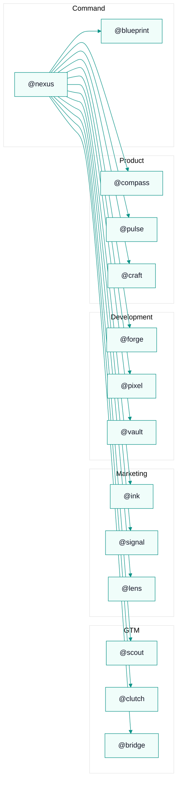

# AGENTS.md — CommissionKit Master Document

**Start here. This file tells you what to read next based on what you're doing.**

---

## Navigation Map

```mermaid
%%{init: {'theme': 'base', 'themeVariables': { 'primaryColor': '#F0FDFA', 'primaryTextColor': '#111827', 'primaryBorderColor': '#0D9488', 'lineColor': '#0D9488', 'secondaryColor': '#F3F4F6', 'tertiaryColor': '#FFFFFF' }}}%%
graph TD
    AGENTS["AGENTS.md<br/>You are here"] --> TECH[Technical Work]
    AGENTS --> BIZ[Business Work]
    AGENTS --> AGENTS_CONFIG[Agent Configuration]
    AGENTS --> STATUS[Progress & Status]

    TECH --> C1[context/project-overview.md]
    TECH --> C2[context/architecture.md]
    TECH --> C3[context/ui-tokens.md]
    TECH --> C4[context/ui-rules.md]
    TECH --> C5[context/ui-registry.md]
    TECH --> C6[context/code-standards.md]
    TECH --> C7[context/library-docs.md]
    TECH --> C8[context/build-plan.md]
    TECH --> C9[context/progress-tracker.md]

    BIZ --> AFFINE["AFFiNE OS<br/>affine.commissionk.it"]
    BIZ --> O1[os/agents/]
    BIZ --> O2[os/skills/]

    AGENTS_CONFIG --> CONFIG["/root/.config/opencode/opencode.jsonc"]
    STATUS --> PT["context/progress-tracker.md"]
```



---

## Task-Based Reading Order

### If you're building code or fixing bugs:
1. Read this file (AGENTS.md) — the rules below
2. `context/project-overview.md` — what the product does
3. `context/architecture.md` — how it's structured
4. `context/code-standards.md` — how to write code
5. `context/ui-rules.md` + `context/ui-tokens.md` — design rules
6. `context/library-docs.md` — libraries we use
7. Do the work → run `bun test` → update `context/progress-tracker.md`

### If you're writing content or doing sales:
1. Read this file (AGENTS.md) — know the product
2. Open AFFiNE OS (`https://affine.commissionk.it`) — company identity, sales system, marketing system
3. Do the work → update `os/STATUS.md`

### If you're planning a feature:
1. Read this file (AGENTS.md)
2. `context/project-overview.md` + `context/architecture.md`
3. Open AFFiNE OS — product system, OKRs
4. Load `/architect` skill → produce plan

### If you're deploying or handling infrastructure:
1. Read this file (AGENTS.md)
2. `context/build-plan.md` — build steps
3. Open AFFiNE OS — engineering system, tools & automation
4. Load `/deploy-verify` skill → follow checklist

---

## Quick Links

| What you need | Where it is |
|---------------|-------------|
| **Product overview** | `context/project-overview.md` |
| **System architecture** | `context/architecture.md` |
| **Design tokens** | `context/ui-tokens.md` |
| **UI rules** | `context/ui-rules.md` |
| **Component registry** | `context/ui-registry.md` |
| **Code standards** | `context/code-standards.md` |
| **Library docs** | `context/library-docs.md` |
| **Build & deploy** | `context/build-plan.md` |
| **Progress tracker** | `context/progress-tracker.md` |
| **Business Operating System** | **AFFiNE** (`https://affine.commissionk.it`) — company identity, strategy, revenue, product, operations, people, customer, tools, governance |
| **OS status** | `os/STATUS.md` |
| **Agent models** | `os/agents/MODEL-ASSIGNMENTS.md` |
| **How to use agents** | `os/agents/OPENCODE-GUIDE.md` |
| **Agent workflows** | `os/agents/<team>/workflows/` |
| **Business skills** | `os/skills/` |

---

<!-- BEGIN:context-order -->

## Technical Context — Read Before Coding

Read in this exact order before any implementation:

1. `context/project-overview.md` — What CommissionKit is, who it serves, core modules
2. `context/architecture.md` — Monorepo structure, backend/frontend architecture, data flow
3. `context/ui-tokens.md` — CSS variables, colors, typography, spacing tokens
4. `context/ui-rules.md` — Component rules, accessibility, responsive design
5. `context/ui-registry.md` — Available UI components and primitives
6. `context/code-standards.md` — TypeScript conventions, import rules, testing standards
7. `context/library-docs.md` — Shared libraries (@workspace/db, @workspace/queue, etc.)
8. `context/build-plan.md` — How to set up, develop, test, and deploy
9. `context/progress-tracker.md` — What's done, what's in progress, what's planned

<!-- END:context-order -->

<!-- BEGIN:business-os -->

## Business Operating System — Read Before Business Tasks

The company OS lives in **AFFiNE** at `https://affine.commissionk.it` for live document management. The `os/` folder in this repo retains the agent workforce, skills, and status tracking:

- **Agent teams** → `os/agents/` — Agent configurations, model assignments, team workflows
- **Business skills** → `os/skills/` — Skill definitions for research, content, sales, social, data, deploy, design
- **Status** → `os/STATUS.md` — Current completion status across all departments

For all company docs (identity, strategy, revenue, product, operations, people, customer, tools, governance), open AFFiNE OS.

<!-- END:business-os -->

<!-- BEGIN:agent-config -->

## AI Agent Configuration

Agents are defined in `/root/.config/opencode/opencode.jsonc`. Use `@agent-name` in chat to invoke them.

**Available agents:**
- `@nexus` — Chief of Staff (default). Routes tasks, coordinates teams.
- `@blueprint` — Company Architect. Organizational design, process architecture, governance.
- `@scout` — Lead Generation. Research, company profiling.
- `@clutch` — Sales Closer. Outreach, demos, closing.
- `@bridge` — Partnerships. Integration partners, co-marketing.
- `@ink` — Content Director. Blog posts, SEO, lead magnets.
- `@signal` — Social Manager. X, LinkedIn, Reddit engagement.
- `@lens` — Growth Analyst. Metrics, dashboards, reports.
- `@forge` — Tech Lead. Code review, architecture, deploy.
- `@pixel` — Frontend Engineer. React components, UI.
- `@vault` — DevOps. Infrastructure, security, monitoring.
- `@compass` — Product Manager. Roadmap, prioritization.
- `@pulse` — User Research. Surveys, interviews, analytics.
- `@craft` — UX Designer. Wireframes, flows, design system.
- `@plan` — Feature Planner. Complex feature planning (/architect).
- `@review` — Code Reviewer. Post-build verification (/review).

**Model assignments** → `os/agents/MODEL-ASSIGNMENTS.md`
**Usage guide** → `os/agents/OPENCODE-GUIDE.md`



<!-- END:agent-config -->

<!-- BEGIN:immutable-rules -->

## Immutable Rules

These never change. Violate them and the PR gets rejected.

- **Bun only.** No npm, yarn, or pnpm commands. `bun run --filter` for workspace scripts.
- **Never hardcoded hex values.** Use CSS variables (`bg-primary`, `text-muted-foreground`, `border-card-border`). No raw Tailwind color classes like `text-gray-500`.
- **No React Router.** Router is Wouter. Do not import `react-router-dom` or use `<BrowserRouter>`.
- **Mongoose, not raw MongoDB.** All DB access goes through Mongoose models from `@workspace/db`.
- **No `console.log` in production code.** Use Pino logger (`src/lib/logger`) on the API, no logging in web components.
- **Test everything that matters.** Run `bun test` before marking work complete. Mock all external services (Stripe, SMTP, S3, Redis).
- **Update `context/progress-tracker.md`** after completing any feature or significant change.
- **Update `os/STATUS.md`** after completing any business process or significant OS change.
- **Before adding a library**, read `context/library-docs.md` for project-specific rules, then check if a skill covers it in `.opencode/skills/`.
- **If the same problem persists after one corrective prompt** — stop immediately and run `/recover`.

<!-- END:immutable-rules -->

<!-- BEGIN:available-skills -->

## Available Skills

### Technical Skills (`.opencode/skills/`)
- `/architect` — before any complex feature. Think before building.
- `/imprint` — after any new UI component. Capture visual patterns to `context/ui-registry.md`.
- `/review` — after building a feature or before demo. Three-layer review: plan, system, production.
- `/recover` — when something breaks after one failed correction. Diagnose first, then fix, reset, or rethink.
- `/remember save` — when a feature spans multiple sessions.
- `/remember restore` — when returning after a multi-session feature.

### Business Skills (`os/skills/`)
- `/research` — systematic web research with source verification
- `/content-seo` — SEO-optimized content creation
- `/sales-outreach` — outreach methodology and objection handling
- `/social-engage` — social media engagement rules
- `/data-report` — structured analytics and reporting
- `/deploy-verify` — safe deployment checklists
- `/design-ux` — UX design workflow and accessibility

<!-- END:available-skills -->

## Monorepo structure

- **Bun** is the only package manager and runtime. Use `bun` for everything.
- Workspace naming: `@workspace/api`, `@workspace/web`, `@workspace/db`, etc.
- Applications live in `artifacts/`, shared libraries in `lib/`, scripts in `scripts/`.
- Business operating system lives in `os/`.
- Technical context lives in `context/`.

## Dev commands

```bash
# API server (port 8088) + BullMQ workers
bun run --filter @workspace/api dev

# Web frontend (port 3000)
bun run --filter @workspace/web dev

# Regenerate API client types, Zod schemas, and React Query hooks from OpenAPI spec
bun run --filter @workspace/api-spec codegen

# Full build (typecheck first, then build all workspaces)
bun run build

# Typecheck only (two-phase: tsc --build on libs, then tsc --noEmit on apps/scripts)
bun run typecheck
```

## Dev Nginx Reverse Proxy

The repo includes `dev.nginx.conf` — an nginx config for remote development. It exposes all dev servers through a single port (443).

| Path | Proxied to | Service |
|------|-----------|---------|
| `/` | `127.0.0.1:3000` | Web (Vite) + HMR WebSocket |
| `/api/*` | `127.0.0.1:8088` | API (Express) |
| `/blog/*` | `127.0.0.1:3001` | Blog (Next.js, /blog prefix stripped) |
| `/admin/queues` | `127.0.0.1:3030` | BullMQ Board |

### Testing

```bash
# Run all tests across the monorepo
bun test

# Run tests for a specific workspace
bun test --filter @workspace/db

# Run a single test file
bun test artifacts/api/src/routes/reps.test.ts

# Run tests with watch mode
bun test --watch

# Run tests with coverage
bun test --coverage
```

### Local prerequisites

- **MongoDB** and **Redis** must be running.
- Spin up via Docker: `docker compose -f infra/database.docker-compose.yml up -d`
- Copy `.env.example` to `.env` in both `artifacts/api/` and `artifacts/web/`.

## Architecture notes

- **Backend**: Express 5 with Mongoose/MongoDB. Entry: `artifacts/api/src/index.ts`.
- **Frontend**: React 19 + Vite 7 + Tailwind CSS 4 + shadcn/ui (Radix). Router is **Wouter**. Data fetching uses TanStack React Query.
- **Auth**: Better Auth integrated into Express 5.
- **Email queue**: BullMQ + Redis. 3 priority tiers → SMTP at 10/sec, concurrency 2.
- **Database**: Mongoose (primary). Connection logic in `@workspace/db`.
- **Shared validation**: Zod schemas in `@workspace/api-zod`.

## TypeScript conventions

- Root `tsconfig.json` uses **project references** for `lib/db`, `lib/api-zod`, and `lib/api-client-react`.
- Lib packages emit declarations to `dist/`; apps run `tsc --noEmit`.
- `moduleResolution`: `bundler`, `target`: `es2022`, `strictNullChecks: true`.

## Design conventions

- **No emojis in UI.** Use Lucide icons exclusively (stroke width 2px, sizes 14-16px for dense UI).
- Font: `Inter`. Financial data must use `tabular-nums`.
- Accent color: Teal-600 (`174 72% 35%` light / `174 60% 48%` dark).
- Light + dark mode via `.dark` class on `<html>`.

## Deployment

- Coolify-managed via `docker-compose.yml` (api + web) and `infra/database.docker-compose.yml` (Mongo + Redis).
- API Dockerfile uses `oven/bun:1.3.13-alpine` single-stage.
- Web Dockerfile builds with Bun, serves via Nginx Alpine with SSR prerendered SEO pages.

## Enterprise Engine Architecture

For custom commission engines (e.g., AISSOL), see:
- `docs/enterprise-engine-architecture.md` — full specification
- `docs/enterprise/aissol.md` — AISSOL-specific documentation

## Additional context

- `docs/` has enterprise engine architecture docs.
- `os/` retains the AI agent workforce (`os/agents/`), business skills (`os/skills/`), and status tracking (`os/STATUS.md`). All other company documents (identity, strategy, revenue, product, operations, people, customer, tools, governance) have been migrated to **AFFiNE** at `https://affine.commissionk.it`.
- `context/` has technical context docs for the codebase.
- No GitHub Actions CI is configured.
