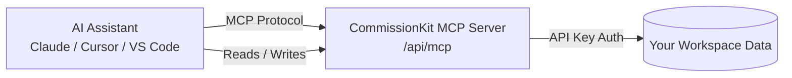

CommissionKit supports the Model Context Protocol (MCP), an open standard that lets AI assistants interact with your workspace data directly. Once connected, AI assistants can query deals, reps, commission runs, payouts, and more — all scoped to your workspace.

## How it works

MCP works through a client-server architecture. CommissionKit acts as the **MCP server**, and your AI assistant (Claude Desktop, Cursor, VS Code, etc.) acts as the **MCP client**.



Each request is authenticated with a workspace-scoped API key. Permissions are enforced per tool, and all actions are attributed to the API key's creator in the audit log.

## Prerequisites

- A CommissionKit workspace with **admin** access
- An API key with the appropriate permissions

## Step 1: Create an API key

1. Go to **Settings** → **API Keys**
2. Click **Create API Key**
3. Give your key a name (e.g., "Claude Desktop", "Development")

### Selecting permissions

You can scope your API key to specific tools:

| Permission | Tools allowed |
|---|---|
| `read:all` | All read-only tools (deals, reps, runs, payouts, disputes, dashboard) |
| `write:deals` | Create and update deals |
| `write:reps` | Create sales reps |
| `write:runs` | Create commission calculation runs |

For AI assistants that only need to view data, `read:all` is sufficient. For assistants that will create or modify data, add the corresponding write permissions.

4. Copy the generated key — it is only shown once

## Step 2: Configure your AI assistant

### Claude Desktop

Add this to your Claude Desktop configuration file (`claude_desktop_config.json`):

```json
{
  "mcpServers": {
    "commissionkit": {
      "url": "https://app.commissionkit.co/api/mcp",
      "headers": {
        "Authorization": "Bearer YOUR_API_KEY"
      }
    }
  }
}
```

Replace `YOUR_API_KEY` with the key you created in Step 1.

### Cursor

In Cursor, go to **Settings** → **Features** → **MCP Servers** and add:

- **Name**: `commissionkit`
- **Type**: `url`
- **URL**: `https://app.commissionkit.co/api/mcp`
- **Headers**: `{ "Authorization": "Bearer YOUR_API_KEY" }`

### VS Code (with MCP extension)

In your VS Code settings (`settings.json`):

```json
{
  "mcp.enabled": true,
  "mcp.servers": {
    "commissionkit": {
      "url": "https://app.commissionkit.co/api/mcp",
      "headers": {
        "Authorization": "Bearer YOUR_API_KEY"
      }
    }
  }
}
```

### Any MCP-compatible client

Point your MCP client to:

```
URL:     https://app.commissionkit.co/api/mcp
Auth:    Bearer YOUR_API_KEY
```

## Available tools

### Deals

| Tool | Description | Required permission |
|---|---|---|
| `list_deals` | List deals with optional filters (stage, payment status, rep) | `read:deals` |
| `get_deal` | Get a single deal by ID | `read:deals` |
| `search_deals` | Search deals by name or customer | `read:deals` |
| `create_deal` | Create a new deal | `write:deals` |
| `update_deal` | Update an existing deal's fields | `write:deals` |

**Constrained fields**:

| Field | Allowed values |
|---|---|
| `stage` | `closed_won`, `closed_lost`, `pending` |
| `paymentStatus` | `unpaid`, `paid`, `partial`, `on_hold` |

### Reps

| Tool | Description | Required permission |
|---|---|---|
| `list_reps` | List all sales reps in the workspace | `read:reps` |
| `get_rep` | Get a single rep by ID with plan info | `read:reps` |
| `create_rep` | Create a new sales rep | `write:reps` |

### Commission Runs

| Tool | Description | Required permission |
|---|---|---|
| `list_runs` | List commission calculation runs | `read:runs` |
| `get_run` | Get run details including per-deal results | `read:runs` |
| `create_run` | Trigger a commission calculation for a period | `write:runs` |

**Constrained fields**:

| Field | Allowed values |
|---|---|
| `status` (filter) | `pending`, `processing`, `completed`, `failed` |
| `paymentStatuses` (filter) | `unpaid`, `paid`, `partial`, `on_hold` |

### Payouts

| Tool | Description | Required permission |
|---|---|---|
| `list_payouts` | List payouts with optional status filter | `read:payouts` |
| `get_payout` | Get details of a specific payout | `read:payouts` |

**Constrained fields**:

| Field | Allowed values |
|---|---|
| `status` | `pending`, `approved`, `paid`, `disputed`, `on_hold` |

### Disputes

| Tool | Description | Required permission |
|---|---|---|
| `list_disputes` | List disputes with optional status filter | `read:disputes` |
| `get_dispute` | Get details of a specific dispute | `read:disputes` |

**Constrained fields**:

| Field | Allowed values |
|---|---|
| `status` | `open`, `under_review`, `resolved` |

### Dashboard

| Tool | Description | Required permission |
|---|---|---|
| `get_dashboard_summary` | Get a dashboard summary with KPIs for the current period | `read:dashboard` |

## Audit trail

Every action performed through the MCP server is recorded in the audit log. The audit events show:

- **User**: `MCP {api_key_name}` (e.g., `MCP Claude Desktop`)
- **User email**: Email of the person who created the API key
- **Action**: The specific action performed
- **Resource**: The affected resource (deal, rep, run, etc.)
- **Changes**: Before/after values for updates

This means you can always trace which API key and which AI assistant performed an operation.

## Security considerations

- API keys are hashed with SHA-256 before storage — CommissionKit cannot retrieve the raw key after creation
- Each API key can be revoked independently from the Settings page
- Permissions are granular — you can create read-only keys for assistants that should only view data
- Invalid or expired keys are rejected immediately with a descriptive error
- All MCP requests are rate-limited and logged

## Troubleshooting

### "Invalid API key format"

Ensure your key starts with `ck_`. Keys follow the format `ck_<base64url>` and are generated from the **API Keys** settings page.

### "Permission denied"

Your API key does not have the required permission for the tool you are trying to use. Create a new key with the appropriate permissions, or update the existing key's permissions from the API Keys settings page.

### "Session not found"

MCP sessions expire after a period of inactivity. The AI assistant will automatically create a new session on the next request.
