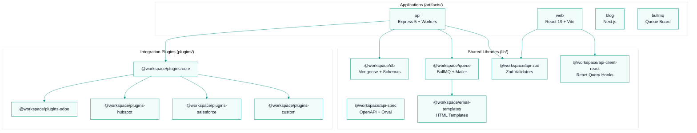
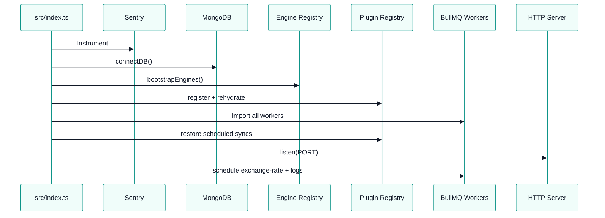
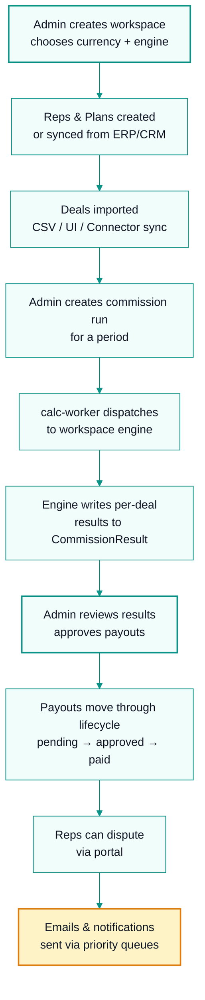

# Architecture — CommissionKit

CommissionKit is a Bun-based monorepo using Bun Workspaces. Applications live in `artifacts/`, shared libraries in `lib/`, integration plugins in `plugins/`, and scripts in `scripts/`.

## Workspace Layout



## Runtime & Build

- **Runtime / Package Manager**: Bun only.
- **TypeScript**: project references for libs (`lib/db`, `lib/api-zod`, `lib/api-client-react`); apps use `tsc --noEmit`.
- **Module resolution**: `bundler`.
- **Target**: `es2022`.

### Key Commands

```bash
bun install
bun run --filter @workspace/api dev          # API on :8088
bun run --filter @workspace/web dev          # Web on :3000
bun run --filter @workspace/blog dev         # Blog on :3001
bun run --filter @workspace/bullmq dev       # Board on :3030
bun run --filter @workspace/api-spec codegen # Regenerate client + Zod
bun run typecheck                            # Two-phase typecheck
bun run build                                # Full build
bun test                                     # All tests
```

## Backend Architecture (`artifacts/api`)

### Stack

- **Framework**: Express 5
- **Auth**: Better Auth with MongoDB adapter (`@better-auth/mongo-adapter`)
- **Database**: Mongoose on MongoDB
- **Queues**: BullMQ + Redis
- **Validation**: Zod (shared via `@workspace/api-zod`)
- **Logging**: Pino + pino-http
- **Monitoring**: Sentry

### Boot Sequence



### Request Pipeline

```mermaid
%%{init: {'theme': 'base', 'themeVariables': { 'primaryColor': '#F0FDFA', 'primaryTextColor': '#111827', 'primaryBorderColor': '#0D9488', 'lineColor': '#0D9488', 'secondaryColor': '#F3F4F6', 'tertiaryColor': '#FFFFFF' }}}%%
flowchart LR
    REQ[Incoming Request] --> PINO[pinoHttp Logger]
    PINO --> CORS[CORS + Credentials]
    CORS --> RATE[Rate Limiter]
    RATE --> BULL["Bull Board<br/>/api/admin/queues"]
    BULL --> RAW["Raw Body Parser<br/>Stripe Webhook"]
    RAW --> AUTH["Better Auth<br/>/api/auth/*"]
    AUTH --> JSON[JSON / URL-encoded Parser]
    JSON --> API["API Router<br/>/api"]
    API --> SENTRY[Sentry Error Handler]
    SENTRY --> GLOBAL[Global Error Handler]
    GLOBAL --> RES[Response]

    style AUTH fill:#F0FDFA,stroke:#0D9488,stroke-width:2px
    style API fill:#F0FDFA,stroke:#0D9488,stroke-width:2px
    style GLOBAL fill:#FEE2E2,stroke:#EF4444,stroke-width:2px
```



### Route Modules (`src/routes/`)

| Route | Purpose |
|-------|---------|
| `/healthz` | Health check |
| `/workspaces` | Workspace CRUD, member invites |
| `/reps` | Rep CRUD, bulk import, portal codes |
| `/plans` | Commission plan CRUD with tiers |
| `/deals` | Deal CRUD, bulk CSV import/export |
| `/runs` | Commission run creation + enqueue |
| `/dashboard` | Dashboard stats |
| `/reports` | Analytics reports |
| `/payouts` | Payout lifecycle |
| `/disputes` | Dispute creation/resolution |
| `/billing` | Stripe checkout, subscriptions, webhooks |
| `/notifications` | In-app notifications |
| `/portal` | JWT rep portal auth |
| `/export` | CSV/XLSX exports |
| `/roles` | Custom RBAC roles |
| `/enterprise` | Conditionally mounted enterprise routes (AISSOL) |
| `/integrations` | Connector config and sync triggers |

### Middleware (`src/middleware/`)

- `requireAuth`: Better Auth session verification.
- `requireWorkspaceMember(minRole)`: validates `X-Workspace-ID`, auto-accepts pending invites, sets `req.workspaceId`/`req.workspaceRole`.
- `requirePermission(resource, action)`: RBAC permission check with Redis cache.
- `requireGrowthPlan`: subscription gating for premium features.

### Commission Engine (`src/workers/engines/`)

- `CalcEngine.ts`: interface for inputs/outputs/results/summary/features.
- `registry.ts`: map of engine name → instance; bootstrapped at startup.
- `standard.engine.ts`: flat / tiered / accelerator logic with multi-currency conversion.
- `aissol.engine.ts`: enterprise slab + GM-bracket matrix for AISSOL.

The `calc-worker.ts` dispatcher reads `workspace.commissionEngine`, fetches the engine, and saves results to the shared `CommissionResult` collection.

### Workers (`src/workers/`)

| Worker | Queue | Purpose |
|--------|-------|---------|
| calc-worker | `commission-calc` | Commission calculation dispatch |
| sync-reps-worker | `sync-reps` | Ingest normalized reps from connectors |
| sync-deals-worker | `sync-deals` | Ingest normalized deals from connectors |
| webhook-ingress-worker | `webhook-ingress` | Receive connector webhooks |
| logs-worker | `logs-flush` | Flush logs to S3 |

## Frontend Architecture (`artifacts/web`)

### Stack

- **Framework**: React 19
- **Bundler**: Vite 7 with SSR prerender
- **Styling**: Tailwind CSS 4 + CSS variables
- **Components**: shadcn/ui (Radix primitives)
- **Routing**: Wouter
- **State/Data**: TanStack React Query, Zustand (sync store)
- **Auth**: Better Auth client via `@/lib/auth-client`
- **API client**: auto-generated React Query hooks (`@workspace/api-client-react`) + custom `apiFetch`
- **i18n**: react-i18next
- **Charts**: Recharts
- **Icons**: Lucide React

### Entry Points

- `src/main.tsx`: hydrate or create root, load Sentry + i18n.
- `src/App.tsx`: providers, routing, layout, engine guards.
- `src/entry-server.tsx`: SSR entry for prerender.

### Routing

Public routes (no workspace required): landing, pricing, legal, contact, calculator, auth pages, portal, accept-invite.
Protected routes (require auth + workspace) are rendered inside `Layout` with sidebar + header.

Engine guards redirect standard engine users to normal pages and enterprise engine users to `/dash/enterprise/*` pages.

### State Providers

- `ThemeProvider`: light/dark mode.
- `AuthProvider`: Better Auth session, base URL setup.
- `WorkspaceProvider`: fetches workspaces, persists active workspace in `localStorage`, sets `X-Workspace-ID` for API client.
- `TooltipProvider`: global tooltip context.

### Key Hooks

- `useAuth`: session + signOut.
- `useWorkspace`: workspaces, active workspace, switcher, create workspace, engine nav items.
- `useTheme`: theme toggle.
- `useRole`: permission checks.
- `useNotifications`: notification bell + badge.
- `useSyncStore`: sync error indicator.

### Page Organization

```
src/pages/
├── landing/            # Marketing landing page sections
├── auth/               # Login, register, reset, verified
├── dashboard.tsx       # Main dashboard
├── commission/         # Plans, deals, runs, run-details
├── team/               # Team members, reps, accept-invite
├── payouts/            # Payouts, disputes
├── portal/             # Standard rep portal
├── enterprise/aissol/  # AISSOL-specific pages
├── settings/           # Workspace settings, billing, roles
├── integrations/       # Connector config UI
├── reports/            # Analytics reports
├── legal/              # Privacy, terms, security
└── ...                 # Static marketing pages
```

## Shared Libraries

### `@workspace/db`

- Mongoose connection (`connectDB`).
- Schema definitions: reps, plans, deals, commission runs, workspaces, subscriptions, payouts, disputes, roles, integration connection/sync/log, exchange rates.
- AISSOL-specific schemas under `schema/aissol/`.
- Plan limits (`lib/db/src/limits.ts`).

### `@workspace/queue`

- Redis connection (`getRedisClient`) with mock mode for tests.
- Queue definitions with retry/backoff.
- `enqueueEmail`, `enqueueCommissionCalc`, `enqueueExchangeRateSync`, `enqueueLogsFlush`.
- Mailer with Nodemailer + SMTP verification.
- Worker implementations: priority routing → SMTP execution; exchange-rate sync.
- Exchange-rate fetcher storing rates in MongoDB.

### `@workspace/api-spec` / `@workspace/api-zod` / `@workspace/api-client-react`

- `lib/api-spec/openapi.yaml`: canonical OpenAPI 3.0 spec.
- `orval.config.ts`: generates `lib/api-client-react/src/generated/api.ts` and `lib/api-zod/src/generated/api.ts`.
- API and web consume shared Zod schemas for validation.

### `@workspace/email-templates`

HTML string templates:
- welcome, invitation, password reset, email verification, verification code
- commission run completion, clawback alert, rep portal access
- payout update, dispute update

## Integration Plugins (`plugins/`)

Each plugin implements `CKitPlugin` from `@workspace/plugins-core`:

- `core`: base types, registry, HTTP client, normalization helpers.
- `custom`: generic REST connector with JSONPath field mapping.
- `odoo`: reps from `res.users`, deals from `sale.order`, invoice-derived payment status.
- `salesforce`: OAuth 2.0 Client Credentials, opportunity sync.
- `hubspot`: owner/deal sync with pipeline stage mapping.

Plugins are registered at API boot and support scheduled sync, webhook ingress, and egress write-back.

## Data Flow



## Deployment

- Coolify-managed via `docker-compose.yml`.
- API Dockerfile: `oven/bun:1.3.13-alpine` single-stage.
- Web Dockerfile: Bun build + Nginx Alpine with prerendered SEO pages.
- Database stack: `infra/database.docker-compose.yml` (Mongo 7.0 + Redis 7).
- Nginx reverse proxy: `dev.nginx.conf` for local/remote dev on port 443 (HTTPS).

---
## Where to Go Next

- Back to entry point: `AGENTS.md`
- Next in technical series: `context/ui-tokens.md`
- Related business context: AFFiNE OS (`https://affine.commissionk.it`)
