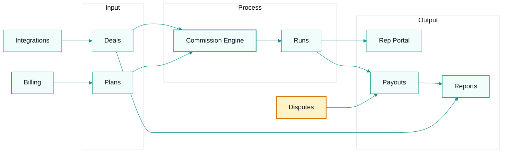

# Project Overview — CommissionKit

CommissionKit is a premium B2B SaaS platform for sales commission management. It helps 5–100+ rep sales teams import deals, model commission plans, run calculations, manage payouts, and give reps a transparent earnings portal.

## Product Purpose

- **Accuracy**: eliminate shadow accounting and disputes with a standardized calculation engine.
- **Efficiency**: replace manual spreadsheet work with automated commission runs.
- **Motivation**: give reps real-time visibility into earnings and performance.

## Core Modules

## Subscription Tiers

| Plan | Price | Reps | Members | Notes |
|------|-------|------|---------|-------|
| Free / Trial | — | 3 | 1 | Trial is 14 days, one-time per workspace. |
| Starter | $49/mo or $490/yr | 10 | 3 | Annual saves 17%. |
| Growth | $99/mo or $990/yr | 50 | 15 | Payouts, CSV export, integrations unlocked. |
| Pro | $249/mo or $2490/yr | 100 | 50 | Full feature set. |
| Extra reps | $8/rep/mo or $80/rep/yr | — | — | Added on top of base plan. |

## Target Users

- **Admins / Finance**: configure plans, run calculations, approve payouts, resolve disputes.
- **Sales Managers**: track team performance, run reports, audit commissions.
- **Sales Reps**: view earnings, deal breakdowns, commission history, submit disputes.

## Key Differentiators

1. **Pluggable commission engines**: standard flat/tiered/accelerator plus isolated enterprise engines (e.g., AISSOL slab + margin matrix).
2. **Multi-currency with exchange-rate snapshots**: 170+ currencies, auditable conversions.
3. **ERP/CRM connectors**: scheduled sync with hash-based change detection.
4. **Rep portal**: separate JWT auth, no corporate credentials needed.
5. **RBAC + custom roles**: owner/admin/member plus granular `resource:action` permissions.

## Entry Points

- **API**: `artifacts/api/src/index.ts`
- **Web SPA**: `artifacts/web/src/main.tsx`
- **Blog**: `artifacts/blog/`
- **BullMQ Board**: `artifacts/bullmq/`

## External Dependencies

- MongoDB (default `mongodb://localhost:27017/commissionkit`)
- Redis (default `redis://localhost:6379`)
- Stripe (payments)
- SMTP provider (emails)
- S3-compatible storage (log uploads)

---
## Where to Go Next

- Back to entry point: `AGENTS.md`
- Next in technical series: `context/architecture.md`
- Related business context: AFFiNE OS (`https://affine.commissionkit.co`)
