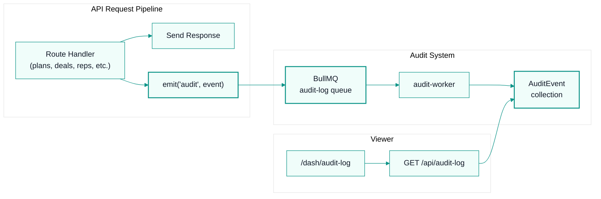

# PRD: Audit Trail

**Author:** @compass (Product Manager)  
**Status:** Draft  
**Priority:** P1 — High  
**Created:** 2026-07-18  
**Estimated effort:** 8-10 engineering days across 3 phases  

---

## 1. Problem Statement

### Current Situation

CommissionKit processes hundreds of mutations daily across plans, deals, reps, payouts, and workspace settings. Every create, update, and delete is executed and forgotten — no record of who did what, when, or why.

When a finance manager asks "who changed the commission rate on the Q3 accelerator plan?", the answer is: we don't know. When a rep disputes a payout and claims their deal was modified after the run, there is no way to prove what happened.

### User Pain Points

| Pain | Who feels it | Frequency | Severity |
|------|-------------|-----------|----------|
| Cannot trace who changed a plan, deal, or rep | Admins, Finance | Weekly | High — blocks dispute resolution |
| No proof of approval for payouts | Admins, Auditors | Per payout cycle | High — compliance gap |
| Cannot reconstruct timeline for commission disputes | Admins, Sales Managers | Monthly | High — erodes rep trust |
| No evidence for SOC 2 / compliance audits | Founders, Enterprise buyers | Per sales cycle | Critical — blocks enterprise deals |
| Deleted resources leave no trace | Admins | Occasional | Medium — data loss without recourse |
| Cannot prove who invited or removed team members | Admins | Occasional | Medium — security concern |

### Business Impact

1. **Enterprise sales blocker.** SOC 2 Type II requires auditable change logs. Without an audit trail, CommissionKit is disqualified from procurement processes at companies with 50+ reps — the exact segment where Pro plan ($249/mo) and extra-rep revenue ($8/rep/mo) compound.

2. **Dispute resolution is guesswork.** When a rep submits a dispute claiming a deal was altered post-run, admins have no way to verify. This erodes trust in the platform and forces manual investigation (emails, Slack threads, memory).

3. **Shadow accounting persists.** The core value proposition of CommissionKit is eliminating shadow accounting. Without an audit trail, finance teams still maintain parallel spreadsheets "just in case" — undermining the product's reason to exist.

---

## 2. Proposed Solution

### Overview

A workspace-scoped, append-only audit log that captures every mutation across all CommissionKit resources. Events are written asynchronously (zero impact on API latency), stored in MongoDB with proper indexes, and surfaced through a filterable, searchable viewer at `/dash/audit-log`.

### Architecture at a Glance



**Key design decision: async via BullMQ.** The audit event is emitted after the response is sent, enqueued to a dedicated `audit-log` BullMQ queue, and persisted by a worker. This guarantees zero latency impact on existing CRUD endpoints. The pattern mirrors how `enqueueEmail` and `enqueueCommissionCalc` already work in `@workspace/queue`.

---

## 3. User Stories

### Phase 1 — MVP

| ID | Story | Acceptance Criteria |
|----|-------|-------------------|
| US-1 | As an admin, I can view a chronological audit log for my workspace | Page at `/dash/audit-log` shows events in reverse-chronological order with pagination (50 per page). Each row shows: timestamp, user name, action, resource type, resource name/ID. |
| US-2 | As an admin, I can filter audit events by date range | Date range picker (using `DatePicker` component) filters events by `createdAt`. Default: last 30 days. |
| US-3 | As an admin, I can filter by user | Multi-select dropdown populated with workspace members. Shows "System" for automated events (connector syncs, scheduled jobs). |
| US-4 | As an admin, I can filter by action type | Multi-select: Created, Updated, Deleted. |
| US-5 | As an admin, I can filter by resource type | Multi-select: Plan, Deal, Rep, Run, Payout. (Phase 1 scope.) |
| US-6 | As an admin, I can search by resource name or ID | Text input searches across `resourceName` and `resourceId` fields. Debounced 300ms. |
| US-7 | As an admin, I can see who made each change | User column shows member name + email. Deleted users show "Deleted user" with their last-known name preserved in the event. |
| US-8 | As an admin, I cannot accidentally delete or modify audit events | Audit log is read-only. No delete/edit actions in the UI. API rejects all non-GET requests. |

### Phase 2 — Field-Level Diffs & Export

| ID | Story | Acceptance Criteria |
|----|-------|-------------------|
| US-9 | As an admin, I can expand an "Updated" event to see field-level diffs | Clicking a row opens an expanded view showing: field name, previous value, new value. Sensitive fields show `[REDACTED]`. |
| US-10 | As an admin, I can export audit logs to CSV | Export button generates a CSV with all columns. Respects active filters. Uses existing `/api/export` pattern. |
| US-11 | As an admin, I can see IP address and user agent for each event | IP column in table. User agent shown in expanded detail view. |
| US-12 | As an admin, I can view audit events for Disputes, Roles, Settings, Members, Workspaces, Billing, and Integrations | Resource type filter expands to include all resource types. |

### Phase 3 — Auth Events & Compliance

| ID | Story | Acceptance Criteria |
|----|-------|-------------------|
| US-13 | As an admin, I can see auth events (login, logout, password change, invite sent/accepted, role changes) | New action types: `login`, `logout`, `password_changed`, `invite_sent`, `invite_accepted`, `role_changed`. |
| US-14 | As a compliance officer, I can view audit logs with a dedicated "auditor" role | Custom role with `audit_log:read` permission. Read-only access to audit log page. No access to other workspace data. |
| US-15 | As an admin, audit events older than the retention period are automatically archived | Configurable retention (default: 1 year). Events past retention are moved to a cold-storage collection. Viewer shows "Archived events available from [date]" with a restore action. |
| US-16 | As an enterprise admin, I can stream audit events to an external SIEM | Webhook endpoint that POSTs new events to a configured URL. HMAC-signed payloads. Configurable in Settings. |

---

## 4. Functional Requirements

### 4.1 Event Capture

Every mutation across the following resources MUST produce an audit event:

| Resource | Actions Logged | Phase |
|----------|---------------|-------|
| Plans | create, update, delete | 1 |
| Deals | create, update, delete, bulk_import | 1 |
| Reps | create, update, delete, bulk_import | 1 |
| Commission Runs | create, approve | 1 |
| Payouts | create, approve, mark_paid, reject | 1 |
| Disputes | create, resolve, reject | 2 |
| Roles | create, update, delete | 2 |
| Workspace Settings | update (name, currency, engine) | 2 |
| Workspace Members | invite, accept, remove, role_change | 2 |
| Billing | subscription_change, plan_upgrade, plan_downgrade | 2 |
| Integrations | connect, disconnect, sync_triggered | 2 |
| Auth | login, logout, password_change, email_verified | 3 |

### 4.2 Event Schema

```typescript
interface AuditEvent {
  _id: Types.ObjectId;
  workspaceId: Types.ObjectId;
  
  // Actor
  actorId: Types.ObjectId | null;     // null for system events
  actorName: string;                   // denormalized — preserved even if user deleted
  actorEmail: string;                  // denormalized
  
  // Action
  action: 'created' | 'updated' | 'deleted' | 'approved' | 'rejected' | 
          'invite_sent' | 'invite_accepted' | 'role_changed' | 
          'login' | 'logout' | 'password_changed' | 
          'bulk_import' | 'sync_triggered' | 'subscription_changed';
  
  // Resource
  resourceType: 'plan' | 'deal' | 'rep' | 'run' | 'payout' | 'dispute' | 
                'role' | 'workspace' | 'member' | 'billing' | 'integration';
  resourceId: string;
  resourceName: string;                // denormalized — plan name, deal name, rep name
  
  // Changes (for updates)
  changes?: FieldChange[];
  
  // Context
  ipAddress: string;
  userAgent: string;
  source: 'ui' | 'api' | 'connector' | 'system';
  
  // Timestamps
  createdAt: Date;
}

interface FieldChange {
  field: string;
  from: unknown;                       // previous value (null for creates)
  to: unknown;                         // new value (null for deletes)
  redacted?: boolean;                  // true if field is sensitive
}
```

### 4.3 Sensitive Field Redaction

The following fields MUST NEVER appear in audit event `changes`:

- `password`, `passwordHash`, `passwordResetToken`
- `stripeSecretKey`, `stripeWebhookSecret`
- `smtpPass`, `sessionSecret`
- `apiKey`, `apiSecret`, `accessToken`, `refreshToken`
- `privateKey`, `clientSecret`
- Any field matching the pattern `*secret*`, `*token*`, `*password*`, `*key*` (case-insensitive)

When a sensitive field is detected in a diff, the `changes` entry is stored as:
```json
{ "field": "stripeSecretKey", "from": "[REDACTED]", "to": "[REDACTED]", "redacted": true }
```

### 4.4 System Events

Automated actions (connector syncs, scheduled exchange-rate updates, sample data seeding) are logged with:
- `actorId: null`
- `actorName: "System"`
- `source: "system"` or `source: "connector"`

This ensures the audit log is complete without attributing automated actions to a human.

### 4.5 Audit Log API

```
GET /api/audit-log
  Query params:
    - page (default: 1)
    - limit (default: 50, max: 200)
    - startDate (ISO 8601)
    - endDate (ISO 8601)
    - actorId (ObjectId)
    - action (comma-separated)
    - resourceType (comma-separated)
    - search (string — matches resourceName or resourceId)
  
  Response:
    { data: AuditEvent[], totalCount: number, page: number, totalPages: number }
  
  Auth: requirePermission('audit_log', 'read')
  
GET /api/audit-log/export
  Same query params as above.
  Returns: CSV file download.
  Auth: requirePermission('audit_log', 'read')
```

### 4.6 RBAC Permission

New permission resource: `audit_log` with action `read`.

Default role assignments:
- **Owner**: `audit_log:read` — yes
- **Admin**: `audit_log:read` — yes
- **Member**: `audit_log:read` — no
- **Auditor** (new custom role, Phase 3): `audit_log:read` — yes, all other resources — no

---

## 5. UX/UI Requirements

### 5.1 Navigation

- **Sidebar location:** Operations group, below Reports, above Integrations.
- **Icon:** `ScrollText` from `lucide-react` (stroke width 2px, size 16px).
- **Label:** "Audit Log"
- **Visibility:** Only shown if user has `audit_log:read` permission (checked via `useRole` hook).

### 5.2 Page Layout

```
┌─────────────────────────────────────────────────────────────┐
│  Audit Log                                    [Export CSV]  │
│  Track every change made in this workspace                  │
├─────────────────────────────────────────────────────────────┤
│  [Date Range ▾] [User ▾] [Action ▾] [Resource ▾] [Search…] │
├─────────────────────────────────────────────────────────────┤
│  Timestamp     User          Action    Resource   Changes   │
│  ────────────────────────────────────────────────────────── │
│  Jul 18 14:32  Sarah Chen    Updated   Plan       3 fields │
│  Jul 18 14:28  Mike Ross     Created   Deal       —        │
│  Jul 18 14:15  System        Synced    Rep        12 reps  │
│  Jul 18 13:50  Sarah Chen    Approved  Payout     $4,200   │
│  Jul 18 13:45  Sarah Chen    Deleted   Rep        —        │
│  ────────────────────────────────────────────────────────── │
│  Showing 1-50 of 1,247 events          [← Prev] [Next →]   │
└─────────────────────────────────────────────────────────────┘
```

### 5.3 Component Mapping

| UI Element | Component | Source |
|-----------|-----------|--------|
| Page wrapper | `Card` | `@/components/ui/card` |
| Date range filter | `DatePicker` (range mode) | `@/components/ui/date-picker` |
| User filter | `Select` (multi) | `@/components/ui/select` |
| Action type filter | `Select` (multi) | `@/components/ui/select` |
| Resource type filter | `Select` (multi) | `@/components/ui/select` |
| Search input | `Input` | `@/components/ui/input` |
| Events table | `Table`, `TableHeader`, `TableBody`, `TableRow`, `TableCell` | `@/components/ui/table` |
| Action badges | `Badge` | `@/components/ui/badge` |
| Pagination | `Pagination` | `@/components/ui/pagination` |
| Export button | `Button` variant="outline" | `@/components/ui/button` |
| Expanded diff view | `Collapsible` | `@/components/ui/collapsible` |
| Empty state | `Empty` with `ScrollText` icon | `@/components/ui/empty` |
| Loading state | `Skeleton` rows | `@/components/ui/skeleton` |
| Error state | `Alert` variant="destructive" | `@/components/ui/alert` |

### 5.4 Table Conventions (per `ui-rules.md`)

- **Headers:** `text-[11px] font-semibold text-muted-foreground uppercase tracking-wider`
- **Timestamps:** Relative time (`2 hours ago`) with absolute time on hover via `Tooltip`. Use `tabular-nums`.
- **Action badges:** Color-coded by action type:
  - Created → teal (`bg-secondary text-secondary-foreground`)
  - Updated → blue (`bg-accent text-accent-foreground` with blue variant)
  - Deleted → rose (`bg-destructive/10 text-destructive`)
  - Approved → teal
  - System → muted
- **Financial columns:** `text-right tabular-nums` where applicable.
- **Rows:** Clickable to expand diff view. `cursor-pointer hover:bg-muted/50`.

### 5.5 Expanded Diff View (Phase 2)

When a row with `action: "updated"` is clicked, a `Collapsible` section opens below the row showing:

```
┌──────────────────────────────────────────────────┐
│  Field            Before          After           │
│  ─────────────────────────────────────────────── │
│  commissionRate   8%              10%             │
│  tierThreshold    $50,000         $75,000         │
│  name             Q3 Plan         Q3 Plan v2      │
│  stripeSecretKey  [REDACTED]      [REDACTED]      │
│                                                   │
│  IP: 192.168.1.42  •  Browser: Chrome 126         │
│  Source: UI                                       │
└──────────────────────────────────────────────────┘
```

- Changed values highlighted: old value in `text-destructive` (strikethrough), new value in `text-primary`.
- Redacted fields shown as `[REDACTED]` in `text-muted-foreground italic`.

### 5.6 Empty State

When no events match the current filters:
- Icon: `ScrollText` (muted)
- Headline: "No audit events found"
- Subtext: "Try adjusting your filters or date range."

When the workspace has never had any events:
- Icon: `ScrollText` (muted)
- Headline: "Audit log is empty"
- Subtext: "Changes to plans, deals, reps, runs, and payouts will appear here."

### 5.7 Mobile

- Table scrolls horizontally on small screens (per `ui-rules.md` responsive rule).
- Filter bar collapses into a `Sheet` triggered by a filter icon button.
- Expanded diff view stacks vertically on mobile.

---

## 6. Technical Requirements

### 6.1 Backend

#### New Mongoose Schema

Location: `lib/db/src/schema/auditEvents.ts`

```typescript
const auditEventSchema = new Schema({
  workspaceId: { type: Schema.Types.ObjectId, ref: 'Workspace', required: true, index: true },
  actorId: { type: Schema.Types.ObjectId, ref: 'User', default: null },
  actorName: { type: String, required: true },
  actorEmail: { type: String, required: true },
  action: { type: String, required: true, enum: AUDIT_ACTIONS },
  resourceType: { type: String, required: true, enum: AUDIT_RESOURCE_TYPES },
  resourceId: { type: String, required: true },
  resourceName: { type: String, required: true },
  changes: [{ field: String, from: Schema.Types.Mixed, to: Schema.Types.Mixed, redacted: Boolean }],
  ipAddress: { type: String, default: '' },
  userAgent: { type: String, default: '' },
  source: { type: String, enum: ['ui', 'api', 'connector', 'system'], default: 'ui' },
}, { timestamps: { createdAt: true, updatedAt: false } });

// Compound index for common queries
auditEventSchema.index({ workspaceId: 1, createdAt: -1 });
auditEventSchema.index({ workspaceId: 1, resourceType: 1, createdAt: -1 });
auditEventSchema.index({ workspaceId: 1, actorId: 1, createdAt: -1 });
auditEventSchema.index({ workspaceId: 1, resourceId: 1 });
```

#### Audit Service

Location: `artifacts/api/src/lib/audit.ts`

```typescript
// Core emit function — called from route handlers AFTER response
export function emitAuditEvent(event: Omit<AuditEvent, '_id' | 'createdAt'>): void {
  auditLogQueue.add('audit-event', event, {
    attempts: 3,
    backoff: { type: 'exponential', delay: 1000 },
  });
}

// Diff helper — compares two objects, redacts sensitive fields
export function computeDiff(before: Record<string, unknown>, after: Record<string, unknown>): FieldChange[] {
  // Deep comparison, skip identical values, redact sensitive patterns
}

// Express middleware — extracts IP and user agent for audit context
export function auditContext(req: Request): { ipAddress: string; userAgent: string; source: 'ui' | 'api' } {
  return {
    ipAddress: req.ip || req.headers['x-forwarded-for'] || '',
    userAgent: req.headers['user-agent'] || '',
    source: req.headers['x-request-source'] === 'api' ? 'api' : 'ui',
  };
}
```

#### BullMQ Queue & Worker

Location: `lib/queue/src/queues.ts` (add queue), `artifacts/api/src/workers/audit-worker.ts`

```typescript
// Queue definition (follows existing pattern)
export const auditLogQueue = new Queue('audit-log', { connection: getRedisClient() });

// Worker — persists events to MongoDB
const auditWorker = new Worker('audit-log', async (job) => {
  await AuditEvent.create(job.data);
}, { connection: getRedisClient(), concurrency: 10 });
```

#### Route Integration Pattern

Each existing route handler adds a single line after the successful response:

```typescript
// Example: POST /api/plans
router.post('/plans', ...requirePermission('plans', 'create'), async (req, res) => {
  const plan = await Plan.create(parsedBody);
  
  // Existing response
  res.status(201).json(plan);
  
  // Audit — fire and forget, after response
  emitAuditEvent({
    workspaceId: req.workspaceId,
    actorId: req.user.id,
    actorName: req.user.name,
    actorEmail: req.user.email,
    action: 'created',
    resourceType: 'plan',
    resourceId: plan._id.toString(),
    resourceName: plan.name,
    changes: [],
    ...auditContext(req),
  });
});
```

For updates, the diff is computed before the update:

```typescript
router.put('/plans/:id', ...requirePermission('plans', 'update'), async (req, res) => {
  const before = await Plan.findById(req.params.id).lean();
  const plan = await Plan.findByIdAndUpdate(req.params.id, parsedBody, { new: true });
  
  res.json(plan);
  
  emitAuditEvent({
    // ...
    action: 'updated',
    changes: computeDiff(before, plan.toObject()),
    ...auditContext(req),
  });
});
```

### 6.2 Frontend

#### New Files

| File | Purpose |
|------|---------|
| `artifacts/web/src/pages/audit/audit-log.tsx` | Main audit log page |
| `artifacts/web/src/hooks/use-audit-log.ts` | Data fetching hook using `paginatedFetch` |
| `artifacts/web/src/components/audit/audit-filters.tsx` | Filter bar component |
| `artifacts/web/src/components/audit/audit-table.tsx` | Events table with expandable rows |
| `artifacts/web/src/components/audit/audit-diff.tsx` | Field-level diff view (Phase 2) |

#### Sidebar Update

Add to `artifacts/web/src/components/layout/sidebar.tsx` in the Operations group:

```typescript
{ 
  label: 'Audit Log', 
  href: '/dash/audit-log', 
  icon: ScrollText,
  permission: { resource: 'audit_log', action: 'read' },
}
```

#### Route Registration

Add to `artifacts/web/src/App.tsx`:

```typescript
<Route path="/dash/audit-log" component={AuditLogPage} />
```

Guarded by `requirePermission('audit_log', 'read')` — redirects to dashboard if unauthorized.

### 6.3 OpenAPI Spec

Add to `lib/api-spec/openapi.yaml`:

```yaml
/api/audit-log:
  get:
    summary: List audit events
    tags: [Audit]
    parameters:
      - name: page
      - name: limit
      - name: startDate
      - name: endDate
      - name: actorId
      - name: action
      - name: resourceType
      - name: search
    responses:
      200:
        description: Paginated audit events

/api/audit-log/export:
  get:
    summary: Export audit events as CSV
    tags: [Audit]
    # Same parameters as above
    responses:
      200:
        description: CSV file download
```

After updating the spec, run `bun run --filter @workspace/api-spec codegen` to regenerate client hooks.

---

## 7. Non-Functional Requirements

### 7.1 Performance

| Metric | Target | How |
|--------|--------|-----|
| API response latency impact | 0ms (async logging) | BullMQ queue — event emitted after `res.json()` |
| Audit log page load (10K events) | < 2 seconds | Compound indexes on `workspaceId + createdAt`, pagination at 50/page |
| Audit log search (100K events) | < 3 seconds | Text index on `resourceName`, `resourceId` |
| Worker throughput | 1,000 events/sec | Concurrency 10, bulk insert when batched |

### 7.2 Data Retention

| Setting | Default | Configurable |
|---------|---------|-------------|
| Hot storage retention | 1 year | Yes (workspace settings, Phase 3) |
| Cold storage retention | 7 years | Yes (Phase 3) |
| Auto-archive trigger | Daily cron job | Phase 3 |

Phase 1-2: all events remain in the primary `AuditEvent` collection. No archival.

### 7.3 Immutability

Audit events are **append-only**. No API endpoint exists to update or delete an audit event. The Mongoose schema has no `updatedAt` field. The collection should be configured with MongoDB's `changeStreamPreAndPostImages` disabled (we capture our own diffs).

### 7.4 Security

- Sensitive fields redacted before storage (see Section 4.3).
- Audit log endpoint requires `audit_log:read` permission.
- IP addresses stored but not exposed to non-admin roles.
- Audit events survive user deletion (actor name/email are denormalized).

---

## 8. Scope & Phases

### Phase 1 — MVP (4-5 days)

**Goal:** Core audit logging for the 5 most critical resources + basic viewer.

| Work | Owner | Days |
|------|-------|------|
| `AuditEvent` Mongoose schema + indexes | @forge | 0.5 |
| `audit-log` BullMQ queue + worker | @forge | 0.5 |
| `emitAuditEvent` + `computeDiff` helpers | @forge | 0.5 |
| Instrument Plans, Deals, Reps, Runs, Payouts routes | @forge | 1 |
| `GET /api/audit-log` endpoint with filters + pagination | @forge | 0.5 |
| OpenAPI spec update + codegen | @forge | 0.5 |
| Audit log page (`audit-log.tsx`) with table + filters | @pixel | 1 |
| Sidebar nav item + route registration | @pixel | 0.25 |
| Empty/loading/error states | @pixel | 0.25 |
| Tests (backend: schema, worker, route; frontend: page render) | @forge + @pixel | 1 |

**Phase 1 ships:**
- All CRUD on Plans, Deals, Reps, Runs, Payouts logged.
- Filterable viewer at `/dash/audit-log`.
- Search by resource name/ID.
- Admin-only access via RBAC.

### Phase 2 — Diffs & Export (3-4 days)

**Goal:** Field-level diffs, expanded resource coverage, CSV export.

| Work | Owner | Days |
|------|-------|------|
| Instrument Disputes, Roles, Settings, Members, Workspaces, Billing, Integrations routes | @forge | 1.5 |
| Expandable diff view component (`audit-diff.tsx`) | @pixel | 1 |
| `GET /api/audit-log/export` CSV endpoint | @forge | 0.5 |
| Export button + download handling | @pixel | 0.5 |
| IP address + user agent display | @pixel | 0.25 |
| Tests | @forge + @pixel | 0.75 |

### Phase 3 — Compliance & Auth Events (2-3 days)

**Goal:** Auth event logging, auditor role, retention policies, SIEM integration.

| Work | Owner | Days |
|------|-------|------|
| Auth event hooks (Better Auth middleware) | @forge | 1 |
| Auditor custom role seed + permission | @forge | 0.5 |
| Retention config in workspace settings | @forge + @pixel | 0.5 |
| Archive worker (daily cron, moves old events) | @forge | 0.5 |
| SIEM webhook config + delivery worker | @forge | 0.5 |

---

## 9. Success Metrics

| Metric | Baseline | Target | Measurement |
|--------|----------|--------|-------------|
| Time to answer "who changed X" | Impossible (no data) | < 30 seconds | User testing with 5 admin users |
| API latency regression | N/A | 0ms added latency | P99 latency comparison before/after |
| Audit log page load (10K events) | N/A | < 2 seconds | Lighthouse + server-side timing |
| Enterprise sales blocker removed | SOC 2 gap | Audit log demonstrable | Sales team confirmation |
| Dispute resolution time | Days (manual investigation) | Hours (audit trail available) | Support ticket analysis |
| Audit event capture completeness | 0% | 100% of mutations | Automated test: every CRUD route produces an event |

---

## 10. Risks & Mitigations

| Risk | Likelihood | Impact | Mitigation |
|------|-----------|--------|------------|
| BullMQ worker fails silently, events lost | Low | High — gaps in audit trail | Dead-letter queue + monitoring alert on queue depth > 1000. Worker retries 3x with exponential backoff (existing pattern). |
| Audit log storage grows unbounded | Medium | Medium — MongoDB disk pressure | Phase 3 retention policy. Phase 1-2: monitor collection size, alert at 10GB. |
| Sensitive field leaks into audit events | Low | Critical — security incident | Redaction function with pattern matching (`*secret*`, `*token*`, `*password*`, `*key*`). Unit tests for every known sensitive field. |
| Audit log page is slow with large datasets | Medium | Medium — poor UX | Compound indexes, pagination, server-side filtering. Load test with 100K events before Phase 2 ship. |
| Developers forget to add `emitAuditEvent` to new routes | Medium | High — incomplete audit trail | Code review checklist. Lint rule or test that asserts every POST/PUT/DELETE route calls `emitAuditEvent`. |
| Connector syncs generate too many events | Medium | Low — noise in audit log | Batch sync events: one "Synced 50 deals" event instead of 50 individual events. `source: "connector"` filter in UI. |

---

## 11. Open Questions & Decisions

### Decided

| Question | Decision | Rationale |
|----------|----------|-----------|
| Should we log reads (GET requests)? | **No.** Only mutations. | Read logging would 10x the event volume with minimal compliance value. SOC 2 auditors care about changes, not views. If read logging is needed later, it can be a separate "access log" feature. |
| Should the audit log be immutable? | **Yes.** No deletes, no edits. | Immutability is a core compliance requirement. Allowing admins to purge events defeats the purpose. Retention-based archival is the correct lifecycle management. |
| Should we show events from deleted users? | **Yes.** Show their last-known name. | Actor name and email are denormalized into the event at write time. Deleting a user does not retroactively anonymize their actions. This is critical for accountability. |
| Async (BullMQ) or synchronous logging? | **Async via BullMQ.** | Zero latency impact on existing endpoints. Follows the established pattern (`enqueueEmail`, `enqueueCommissionCalc`). BullMQ retries handle transient failures. |
| Should audit log be available on all plans? | **Yes, but with retention limits.** | Free/Starter: 30-day retention. Growth: 1 year. Pro: configurable. This creates upgrade incentive without gating a compliance feature that enterprise buyers expect. |

### Open (for discussion)

| Question | Options | Recommendation |
|----------|---------|----------------|
| Should we integrate with external SIEM/Splunk? | a) Webhook push, b) Pull API, c) Both | **a) Webhook push** for Phase 3. Simpler to implement, works with most SIEMs. Pull API can be added if enterprise customers request it. |
| Should we support audit log annotations/comments? | a) Yes — admins can add notes to events, b) No | **b) No** for now. Annotations add complexity and raise tampering concerns. If needed, handle via Disputes module. |
| Should connector sync events be individual or batched? | a) One event per synced record, b) One event per sync run | **b) Batched.** "Synced 47 deals from Salesforce" is more useful than 47 individual events. Reduces noise and storage. |

---

## 12. Dependencies

| Dependency | Status | Notes |
|-----------|--------|-------|
| BullMQ + Redis | Available | Already used for email, commission calc, exchange rates, logs. |
| Mongoose + MongoDB | Available | New schema follows existing patterns in `@workspace/db`. |
| RBAC system | Available | New `audit_log:read` permission added to existing role system. |
| Export system | Available | CSV export follows existing `/api/export` pattern. |
| `paginatedFetch` | Available | Frontend data fetching utility already exists in `@/lib/api`. |
| `useRole` hook | Available | Permission gating already implemented. |
| OpenAPI codegen | Available | Spec update triggers auto-generation of client hooks. |

---

## 13. Testing Plan

### Backend Tests

| Test File | Coverage |
|-----------|----------|
| `lib/db/src/schema/auditEvents.test.ts` | Schema validation, required fields, enum constraints, index existence |
| `artifacts/api/src/lib/audit.test.ts` | `emitAuditEvent` enqueues correctly, `computeDiff` produces correct diffs, sensitive field redaction |
| `artifacts/api/src/workers/audit-worker.test.ts` | Worker persists events to MongoDB, handles malformed jobs gracefully |
| `artifacts/api/src/routes/audit-log.test.ts` | GET endpoint returns paginated results, filters work, RBAC enforcement, export endpoint returns CSV |
| Integration tests per instrumented route | Every POST/PUT/DELETE on Plans, Deals, Reps, Runs, Payouts produces an audit event |

### Frontend Tests

| Test File | Coverage |
|-----------|----------|
| `audit-log.test.tsx` | Page renders, filters apply, pagination works, empty state shown |
| `audit-filters.test.tsx` | Filter components render, onChange fires, date range validates |
| `audit-table.test.tsx` | Table renders events, row click expands, badges color-coded |
| `audit-diff.test.tsx` (Phase 2) | Diff view shows changes, redacted fields hidden, before/after formatting |

### Performance Tests

- Load test: insert 100K audit events, verify page load < 2s.
- Latency test: measure P99 of instrumented routes before/after, confirm 0ms regression.

---

## 14. Rollout Plan

1. **Feature flag:** `AUDIT_LOG_ENABLED` environment variable. Default `true` for all workspaces on deploy.
2. **Backfill:** No backfill needed — audit log starts from the moment it ships. Historical data does not exist.
3. **Communication:** In-app notification to all admins: "Audit Log is now available — track every change in your workspace."
4. **Documentation:** Update `/security` page to mention audit logging. Add to enterprise sales deck.

---

## Appendix A: Action Type Reference

| Action | Description | Phase |
|--------|-------------|-------|
| `created` | Resource created via UI or API | 1 |
| `updated` | Resource fields modified | 1 |
| `deleted` | Resource removed | 1 |
| `approved` | Run or payout approved | 1 |
| `rejected` | Payout or dispute rejected | 1 |
| `bulk_import` | CSV/bulk import of deals or reps | 1 |
| `mark_paid` | Payout marked as paid | 1 |
| `invite_sent` | Workspace invitation sent | 2 |
| `invite_accepted` | Invitation accepted by user | 2 |
| `role_changed` | Member role updated | 2 |
| `subscription_changed` | Billing plan changed | 2 |
| `sync_triggered` | Integration sync initiated | 2 |
| `login` | User authenticated | 3 |
| `logout` | User session ended | 3 |
| `password_changed` | Password updated | 3 |

## Appendix B: Sensitive Field Patterns

Fields matching any of these patterns (case-insensitive) are redacted:

```
*password*, *secret*, *token*, *key* (except "keyboard"),
*credential*, *auth*, *session*, *cookie*,
stripeSecretKey, stripeWebhookSecret, smtpPass,
privateKey, clientSecret, accessToken, refreshToken
```

## Appendix C: Plan-Based Retention (Proposed)

| Plan | Hot Retention | Cold Retention | Configurable |
|------|--------------|----------------|-------------|
| Free / Trial | 30 days | None | No |
| Starter | 90 days | None | No |
| Growth | 1 year | 3 years | No |
| Pro | 1 year (default) | 7 years | Yes |

---

*This PRD is a living document. Update it as requirements evolve during implementation.*
