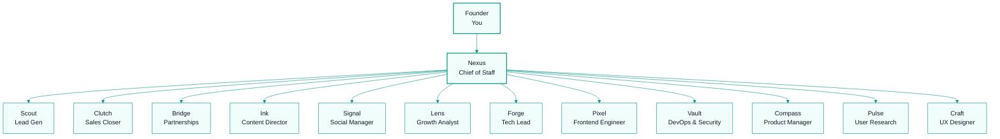

# Team Structure

## Org Chart

## Reporting Lines

| Role | Reports To | AI Agent |
|------|-----------|----------|
| Founder | — | You |
| Chief of Staff | Founder | Nexus |
| GTM Lead | Nexus | Scout |
| Marketing Lead | Nexus | Ink |
| Engineering Lead | Nexus | Forge |
| Product Lead | Nexus | Compass |
| All other agents | Their team lead | Various |

## Decision Rights

| Decision Type | Who Decides |
|---------------|-------------|
| Strategic direction | Founder |
| Day-to-day task routing | Nexus |
| What to build | Compass (with founder approval) |
| How to build it | Forge |
| What to write | Ink |
| Who to sell to | Scout + Clutch |
| Deploy to production | Vault |
| Hire/fire agents | Founder |
| Budget allocation | Founder |
| Technical architecture | Forge + Compass |
| Design decisions | Craft |
| Partnership deals | Bridge (with founder approval) |

## Meeting Rhythm

### Daily (Async)
- Each agent posts status update to their team channel
- Nexus synthesizes into daily briefing

### Weekly (Sync)
- Monday: Strategy review (founder + Nexus + team leads)
- Friday: Week retrospective (what shipped, what blocked)

### Monthly
- OKR review: progress against quarterly goals
- Agent performance: which agents are effective, which need tuning

---
## Where to Go Next

- Back to entry point: `AGENTS.md`
- Next in this department: `os/01-strategy/planning/okrs.md`
- Related technical context: `context/architecture.md`
