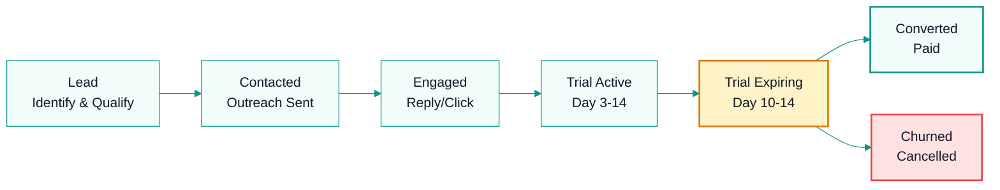

# Sales System

## Ideal Customer Profile (ICP)

**Must-Have:**
- B2B company with dedicated sales team (5+ reps)
- Currently tracking commissions in spreadsheets
- Revenue $1M–$50M ARR

**Strong Signals:**
- Hiring sales ops or commission analysts
- Recent sales team expansion
- Multi-currency deals
- Salesforce/HubSpot/Odoo user

**Industries:**
SaaS, real estate, insurance, distribution, manufacturing, staffing, telecoms

## Lead Stages

| Stage | Definition | Action | Timeframe |
|-------|-----------|--------|-----------|
| Lead | Contact identified | Qualify, enrich | Day 0 |
| Contacted | First outreach sent | Wait 48h | Day 0-1 |
| Engaged | Replied or clicked | Book demo or follow-up | Day 1-3 |
| Trial Active | Signed up for trial | Day 3 & Day 7 check-in | Day 3-14 |
| Trial Expiring | Day 10-14 | Urgency + personal outreach | Day 10-14 |
| Converted | Paid subscriber | Welcome, onboard | Day 14+ |
| Churned | Cancelled | Exit survey, win-back | Ongoing |

## Commission Structure (for human sales reps, when hired)

- **First Invoice:** 30% of customer's first payment
- **Recurring:** 10% of every subsequent payment
- **Extra Reps:** 10% of extra rep charges
- **Clawback:** If customer refunds within 60 days

## Sales Scripts

### Discovery Call (15 min)

**Opening:**
> "Thanks for taking the time. Before I tell you about CommissionKit, I want to understand how you're handling commissions today. What's your current process?"

**Probe:**
1. "How many reps are you tracking commissions for?"
2. "What tool are you using today — Excel, Google Sheets, or something else?"
3. "How often do reps come to you questioning their commission numbers?"
4. "Have you ever had a dispute that took more than a day to resolve?"
5. "Are you dealing with multiple currencies?"

**Transition:**
> "It sounds like [summarize pain point]. I'm going to show you exactly how CommissionKit solves that — and I'll time it, because the full setup takes under 10 minutes."

## Objection Handling

| Objection | Response |
|-----------|----------|
| "We already have a system." | "Most companies do — usually a spreadsheet. The question is: does it scale?" |
| "Too expensive." | "One commission dispute costs more than a month of CommissionKit. How many hours did your team spend on commission math last month?" |
| "We need custom commission logic." | "That's exactly why we built custom engines. Can you share your current commission structure?" |
| "I need to check with my CFO/CEO." | "I'll send you a one-page summary and a Loom walkthrough. When should I follow up — Tuesday or Thursday?" |

## Weekly Targets

| Metric | Target | Owner |
|--------|--------|-------|
| Leads contacted | 50/week | Scout |
| Discovery calls | 10/week | Clutch |
| Demos completed | 5/week | Clutch |
| Trials started | 10/week | Clutch |
| Deals closed | 2/week | Clutch |

## Tools
- **CRM:** Twenty (crm.commissionk.it)
- **Outreach:** Apollo.io / LinkedIn Sales Nav
- **Demo booking:** Calendly
- **Recordings:** Loom

---
## Where to Go Next

- Back to entry point: `AGENTS.md`
- Next in this department: `os/02-revenue/marketing/marketing-system.md`
- Related technical context: `context/project-overview.md`
