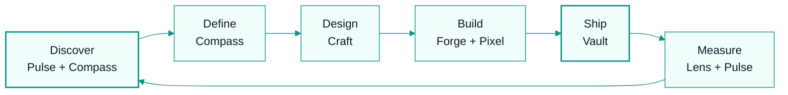

# Product System

## Product Philosophy

**User pain drives priority.** We don't build features because they're cool. We build them because they solve real problems for real users.

## Product Development Process

### 1. Discover (Pulse + Compass)
- Analyze support tickets for recurring themes
- Run user surveys quarterly
- Interview 5 customers per month
- Review usage analytics for drop-off points
- Monitor competitor releases

### 2. Define (Compass)
- Write product brief: Problem → Solution → Success Metrics
- Define acceptance criteria
- Estimate effort (Forge input)
- Prioritize against OKRs

### 3. Design (Craft)
- Map user flows
- Create wireframes
- Define interaction states
- Accessibility check
- Design system compliance

### 4. Build (Forge + Pixel)
- Implementation plan (/architect)
- Code and test
- Three-layer review (/review)

### 5. Ship (Vault)
- Deploy with verification
- Monitor for issues
- Announce to users

### 6. Measure (Lens + Pulse)
- Track adoption of new feature
- Collect feedback
- Iterate based on data

## Roadmap

### Now (This Month)
- [ ] Self-serve onboarding flow
- [ ] In-app product tours
- [ ] Commission calculator (lead magnet)

### Next (Next 2 Months)
- [ ] HubSpot integration
- [ ] Advanced reporting dashboard
- [ ] Multi-currency improvements

### Later (Next Quarter)
- [ ] Salesforce bidirectional sync
- [ ] Mobile-responsive complex tables
- [ ] API webhooks for integrations

### Future
- [ ] AI-powered commission anomaly detection
- [ ] Natural language plan builder
- [ ] Marketplace for custom engines

## Feature Prioritization Framework

| Factor | Weight | How Measured |
|--------|--------|--------------|
| User pain | 30% | Support tickets, surveys, interviews |
| Business impact | 25% | Revenue potential, retention |
| Strategic fit | 20% | Aligns with OKRs |
| Effort | 15% | Engineering estimate |
| Risk | 10% | Technical uncertainty |

**Score = Σ(Factor × Weight)**

## User Feedback Loop

1. **Collect** — Support tickets, in-app feedback, surveys, interviews
2. **Synthesize** — Pulse aggregates themes monthly
3. **Prioritize** — Compass ranks by framework above
4. **Communicate** — Tell users what we built and why
5. **Close loop** — Follow up with users who requested the feature

## Quality Gates

Before any feature ships:
- [ ] Solves a validated user pain
- [ ] Has clear success metrics
- [ ] Design reviewed (Craft)
- [ ] Code reviewed (Forge)
- [ ] Tests pass (bun test)
- [ ] Typecheck passes
- [ ] Accessibility verified
- [ ] Documentation updated

---
## Where to Go Next

- Back to entry point: `AGENTS.md`
- Next in this department: `os/04-operations/operations-system.md`
- Related technical context: `context/progress-tracker.md`
