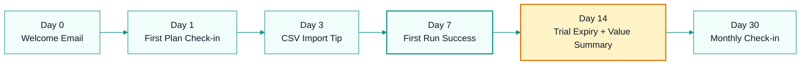
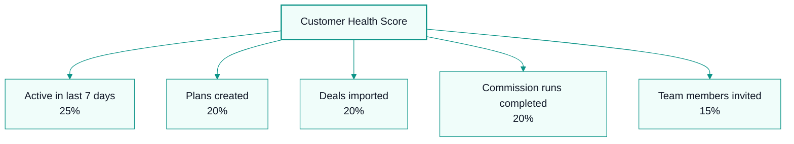

# Customer System

## Support

### Channels
| Channel | Response Time | Owner |
|---------|--------------|-------|
| In-app chat | <4 hours | Pulse (AI) → Founder (escalation) |
| Email support@ | <24 hours | Pulse (AI) → Founder |
| Documentation | Self-serve | Ink + Forge |

### Support Tiers
| Tier | Description | Example |
|------|-------------|---------|
| L1 — Question | How-to, feature explanation | "How do I add a tier to my plan?" |
| L2 — Issue | Bug, unexpected behavior | "My calculation is showing $0" |
| L3 — Escalation | Critical, revenue-impacting | "All my reps see wrong commissions" |

### Response Templates
**L1:**
> "Thanks for reaching out! Here's how to [do the thing]. If you need more help, let me know."

**L2:**
> "I'm sorry you're experiencing this. I've logged this as [issue ID] and our engineering team is investigating. I'll update you within 24 hours."

**L3:**
> "This is urgent. I'm escalating to our engineering lead immediately. Expect a response within 1 hour. In the meantime, [workaround if available]."

## Customer Success

### Onboarding Journey

| Day | Touchpoint | Goal |
|-----|-----------|------|
| 0 | Welcome email + quick start guide | Activate |
| 1 | Check-in: "Need help setting up your first plan?" | First plan created |
| 3 | Tip: "Import deals via CSV in 2 minutes" | First deals imported |
| 7 | Success milestone: "Run your first commission calculation" | First run completed |
| 14 | Trial expiry reminder + value summary | Convert or extend |
| 30 | Monthly check-in: "How's your team using CK?" | Engagement |

### Health Score

| Signal | Weight |
|--------|--------|
| Active in last 7 days | 25% |
| Plans created | 20% |
| Deals imported | 20% |
| Commission runs completed | 20% |
| Team members invited | 15% |

**Score >70:** Healthy — nurture and expand  
**Score 40-70:** At-risk — proactive outreach  
**Score <40:** Critical — immediate intervention

### Retention Playbook
**At-risk signals:**
- No login in 14 days
- Support tickets with frustration tone
- Trial expiring without key actions

**Intervention:**
1. Personal outreach from founder (for now)
2. Offer extended trial or demo
3. Identify and solve blockers
4. If churn: exit survey → win-back campaign in 30 days

### Net Promoter Score (NPS)
- Survey: Quarterly
- Question: "How likely are you to recommend CommissionKit to a colleague?"
- Follow-up: "What's the main reason for your score?"
- Target: NPS >40

## Feedback Loop

1. **Collect** — Support tickets, in-app feedback, surveys, calls
2. **Categorize** — Pulse tags by theme (feature request, bug, praise, confusion)
3. **Prioritize** — Compass ranks by frequency × impact
4. **Communicate** — "You asked, we built" updates
5. **Measure** — Did the fix/feature improve satisfaction?

## Customer Documentation

- **Help Center:** [To be built — Mintlify docs]
- **API Docs:** Auto-generated from OpenAPI spec
- **Video Tutorials:** [To be recorded]
- **Templates:** CSV import templates, plan examples

---
## Where to Go Next

- Back to entry point: `AGENTS.md`
- Next in this department: `os/07-tools/tools-system.md`
- Related technical context: `context/progress-tracker.md`
