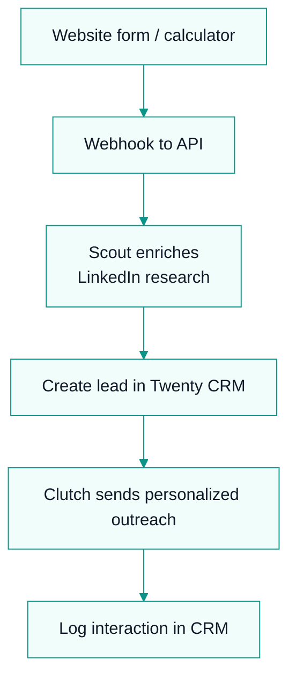
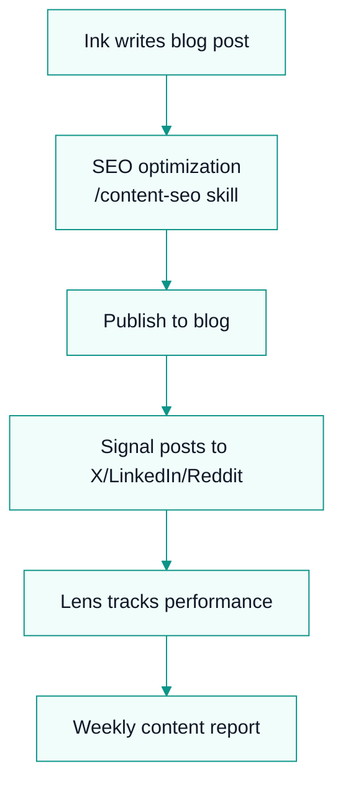
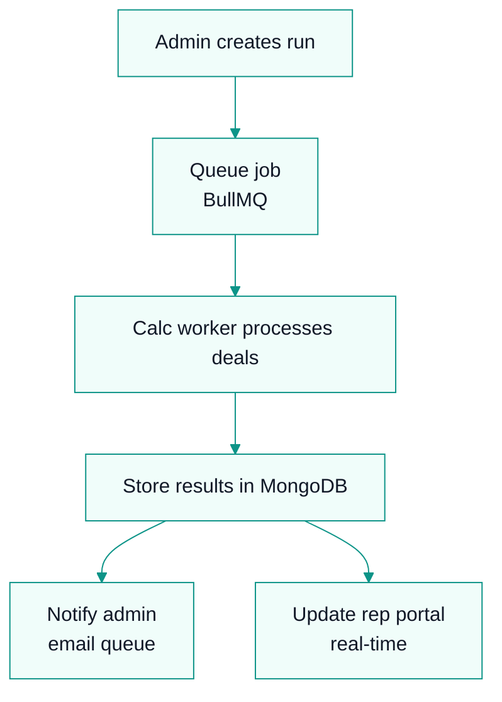
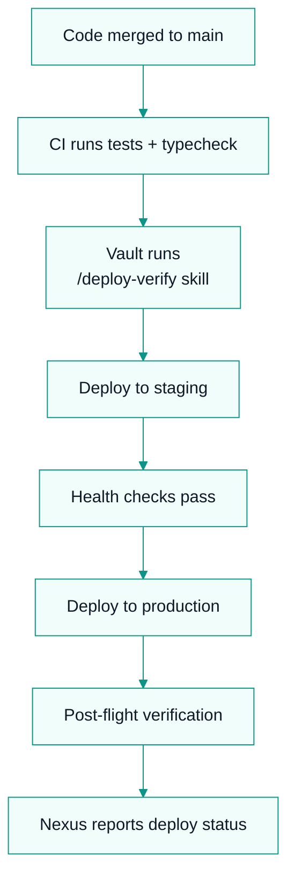
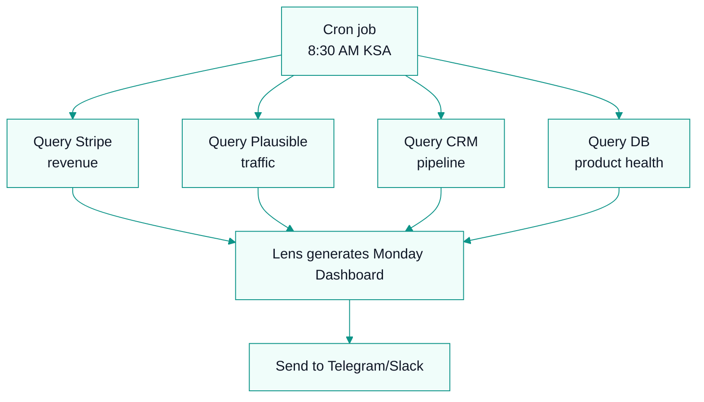

# Tools & Automation System

## Tool Inventory

### Development
| Tool | Purpose | URL | Agent |
|------|---------|-----|-------|
| GitHub | Code hosting | github.com | Forge |
| Coolify | Deployment | labs.kyrazo.com | Vault |
| MongoDB Atlas | Database | — | Vault |
| Redis Cloud | Cache/Queue | — | Vault |
| Stripe | Payments | stripe.com | Vault |
| Sentry | Error tracking | — | Vault |

### Sales & Marketing
| Tool | Purpose | URL | Agent |
|------|---------|-----|-------|
| Twenty CRM | Lead tracking | crm.commissionk.it | Scout |
| Apollo.io | Outreach | — | Clutch |
| Calendly | Scheduling | — | Clutch |
| Plausible | Web analytics | — | Lens |
| Eraser | Diagrams | app.eraser.io | Craft |
| Mintlify | Docs hosting | — | Ink |

### Communication
| Tool | Purpose | Agent |
|------|---------|-------|
| Email | Support, outreach | All |
| Telegram/Slack | Alerts, reports | Nexus |

## Automation Workflows

### Lead Capture → CRM

### Content Pipeline

### Commission Calculation

### Deployment

### Daily Dashboard

## Scripts

| Script | Purpose | Run Frequency | Owner |
|--------|---------|--------------|-------|
| `ck-monday-dashboard.py` | Generate daily briefing | Daily 8:30 AM | Lens |
| `ck-content-review.py` | Analyze content performance | Weekly Monday | Lens |
| `ck-blog-insert.py` | Publish blog to database | On publish | Ink |
| `ck-lead-scoring.py` | Score new leads | Real-time | Scout |
| `ck-outreach-sequence.py` | Send follow-up emails | Daily | Clutch |

## Tool Access Matrix

| Agent | GitHub | Coolify | Stripe | CRM | Eraser | Plausible |
|-------|--------|---------|--------|-----|--------|-----------|
| Nexus | Read | Read | Read | Read | Read | Read |
| Forge | Write | Write | — | — | — | — |
| Vault | Read | Admin | Admin | — | — | — |
| Scout | — | — | — | Write | — | — |
| Clutch | — | — | — | Write | — | — |
| Ink | — | — | — | — | Write | Read |
| Signal | — | — | — | — | — | Read |
| Lens | — | — | Read | Read | — | Admin |
| Craft | — | — | — | — | Write | — |

---
## Where to Go Next

- Back to entry point: `AGENTS.md`
- Next in this department: `os/08-governance/governance-system.md`
- Related technical context: `context/build-plan.md`
