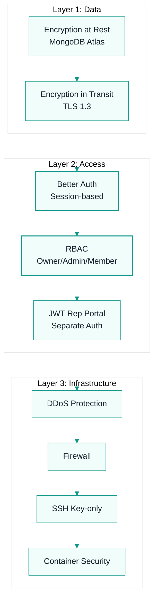

# Governance System

## Security

### Data Protection
- **Encryption at rest:** MongoDB Atlas default encryption
- **Encryption in transit:** TLS 1.3 for all connections
- **API keys:** Environment variables, never in code
- **Secrets rotation:** Quarterly
- **Database access:** IP allowlist + authentication

### Authentication & Authorization
- **User auth:** Better Auth (session-based, MongoDB adapter)
- **Password policy:** Min 8 chars, complexity required
- **Session management:** Secure cookies, httpOnly
- **RBAC:** Owner/Admin/Member + custom roles
- **Rep portal:** JWT-based, separate auth from admin

### Infrastructure Security
- **DDoS protection:** Cloudflare / hosting provider
- **Firewall:** UFW / cloud security groups
- **SSH access:** Key-based only, root disabled
- **Container security:** Non-root user in Docker
- **Dependency scanning:** Monthly (Vault)

### Incident Response
| Severity | Response | Escalation |
|----------|----------|------------|
| Data breach | Immediate (15 min) | Founder + legal |
| Unauthorized access | Immediate (30 min) | Founder + Vault |
| Vulnerability disclosed | 4 hours | Forge + Vault |
| Minor misconfiguration | 24 hours | Vault |

## Compliance

### GDPR (European Users)
- [ ] Privacy policy with data usage explanation
- [ ] User data export functionality
- [ ] Data deletion (right to be forgotten)
- [ ] Consent tracking for emails
- [ ] DPA available for enterprise

### SOC 2 (Future)
- Target: SOC 2 Type II within 18 months
- Requirements:
  - Access controls and audit logs
  - Change management process
  - Backup and disaster recovery testing
  - Security awareness training (for human team)
  - Vendor risk management

### Data Residency
- Default: US-based hosting
- Future: EU region for GDPR compliance
- Enterprise: Customer-choice region

## Audit

### Monthly Security Review
- [ ] Access log review (unusual logins)
- [ ] Dependency vulnerability scan
- [ ] Backup restoration test
- [ ] Secret rotation check
- [ ] Incident response runbook review

### Quarterly Compliance Check
- [ ] Privacy policy accuracy
- [ ] Data retention compliance
- [ ] User request handling (exports/deletions)
- [ ] Vendor security assessments
- [ ] Policy updates

## Risk Register

| Risk | Likelihood | Impact | Mitigation | Owner |
|------|-----------|--------|------------|-------|
| Data breach | Low | Critical | Encryption, access controls, monitoring | Vault |
| Service outage | Medium | High | Redundancy, backups, runbooks | Vault |
| Dependency vulnerability | Medium | Medium | Automated scanning, rapid patching | Vault |
| Founder unavailability | Medium | High | Agent autonomy, documentation | Nexus |
| Compliance violation | Low | High | Regular audits, legal review | Founder |
| Cash runway exhaustion | Medium | Critical | MRR tracking, burn monitoring | Founder + Lens |

## Policies

### Acceptable Use
- No scraping our API without permission
- No reverse engineering our commission engines
- No using the platform for illegal activities
- No sharing account access

### Data Retention
- Active accounts: Data retained indefinitely
- Cancelled accounts: 90 days then soft delete
- Backups: 30 days rolling
- Logs: 90 days

### Vendor Management
Every tool must have:
- Security/privacy policy reviewed
- Data processing agreement (if handles customer data)
- Quarterly re-evaluation

## Business Continuity

### Critical Functions
1. Commission calculations (revenue-impacting)
2. Authentication (access-impacting)
3. Payment processing (revenue-impacting)
4. Data storage (everything-impacting)

### Recovery Time Objectives (RTO)
| Function | RTO | RPO (Data Loss) |
|----------|-----|-----------------|
| Commission calc | 1 hour | 0 (real-time) |
| Auth | 2 hours | 0 |
| Payments | 4 hours | 0 |
| Data | 4 hours | 1 hour |

### Backup Strategy
- MongoDB: Daily automated backup + point-in-time recovery
- Redis: AOF persistence + snapshots
- Code: GitHub (distributed)
- Config: Infrastructure as code (Docker compose)

## Documentation

- **Security policy:** Published at /security
- **Privacy policy:** Published at /privacy
- **Terms of service:** Published at /terms
- **Incident reports:** Internal (not public unless required)
- **Audit logs:** Internal, retained 1 year

---
## Where to Go Next

- Back to entry point: `AGENTS.md`
- Next: `os/agents/MODEL-ASSIGNMENTS.md`
- Related technical context: `context/architecture.md`
