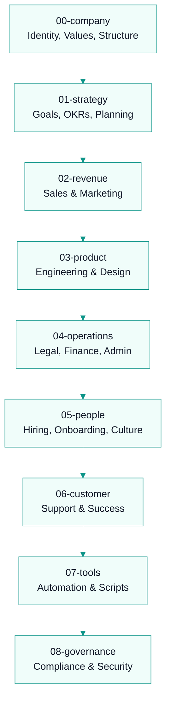
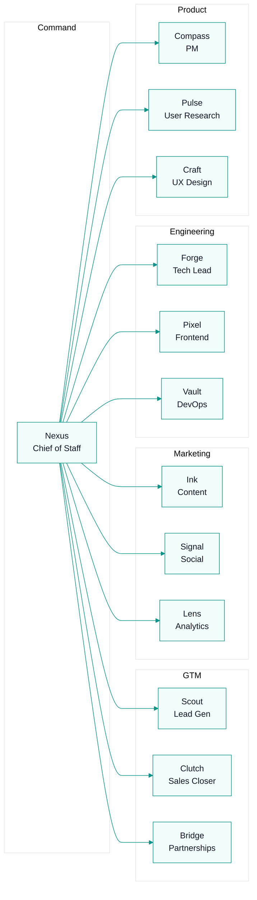

# CommissionKit Operating System

## Company Identity

**Name:** CommissionKit  
**Mission:** Eliminate shadow accounting and commission disputes for sales teams.  
**Vision:** Every sales team has transparent, accurate, and fast commission management.  
**Values:**
1. Accuracy over speed
2. Transparency builds trust
3. Reps deserve clarity
4. Automation replaces spreadsheets

## What We Build

CommissionKit is a B2B SaaS platform for sales commission management.

**Core Modules:**
- Commission Engine (flat, tiered, accelerator, custom)
- Deal Tracking & Import
- Commission Plan Builder
- Commission Runs & Auditing
- Payout Management
- Rep Portal (JWT-based)
- Dispute Resolution
- CRM/ERP Integrations

**Target:** B2B companies with 5-100+ sales reps

## How This OS Works

This folder contains the entire operating system of CommissionKit as a company. Every team, process, tool, and decision lives here.

## Agent Teams

Our AI workforce maps to these folders:

## Status

All 8 departments have foundational content. Each folder is actively maintained and grows as processes mature. See `os/STATUS.md` for detailed completion status and next priorities.

---
## Where to Go Next

- Back to entry point: `AGENTS.md`
- Next: `os/STATUS.md`
- Start a department: `os/00-company/identity/company-identity.md`
