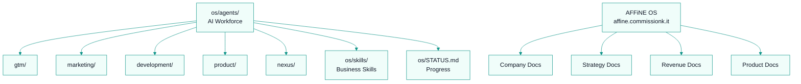
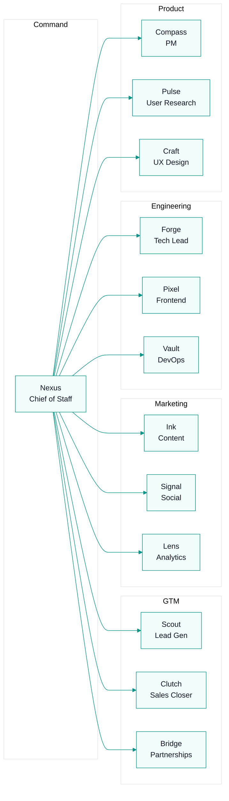

# CommissionKit Operating System

## Company Identity

**Name:** CommissionKit  
**Mission:** Eliminate shadow accounting and commission disputes for sales teams.  
**Vision:** Every sales team has transparent, accurate, and fast commission management.  
**Values:**
1. Accuracy over speed
2. Transparency builds trust
3. Reps deserve clarity
4. Automation replaces spreadsheets

## What We Build

CommissionKit is a B2B SaaS platform for sales commission management.

**Core Modules:**
- Commission Engine (flat, tiered, accelerator, custom)
- Deal Tracking & Import
- Commission Plan Builder
- Commission Runs & Auditing
- Payout Management
- Rep Portal (JWT-based)
- Dispute Resolution
- CRM/ERP Integrations

**Target:** B2B companies with 5-100+ sales reps

## How This OS Works

The company operating system has been migrated to **AFFiNE** for live collaborative document management. All company documents (identity, strategy, revenue, product, operations, people, customer, tools, governance) live at:

> **https://affine.commissionk.it**

This repo's `os/` folder retains only operational files:

| What | Where | Purpose |
|------|-------|---------|
| Agent teams & workflows | `os/agents/` | AI workforce configuration, team structure, team-specific workflows and scripts |
| Business skills | `os/skills/` | Skill definitions used by agents (research, content, sales, social, data, deploy, design) |
| Status tracker | `os/STATUS.md` | Current completion status across all departments |

## Agent Teams

Our AI workforce is managed from `os/agents/`:

## Status

All 8 departments have foundational content in AFFiNE. Each department is actively maintained and grows as processes mature. See `os/STATUS.md` for detailed completion status and next priorities.

---
## Where to Go Next

- Back to entry point: `AGENTS.md`
- Next: `os/STATUS.md`
- Agent teams: `os/agents/`
- Open AFFiNE OS: `https://affine.commissionk.it`
